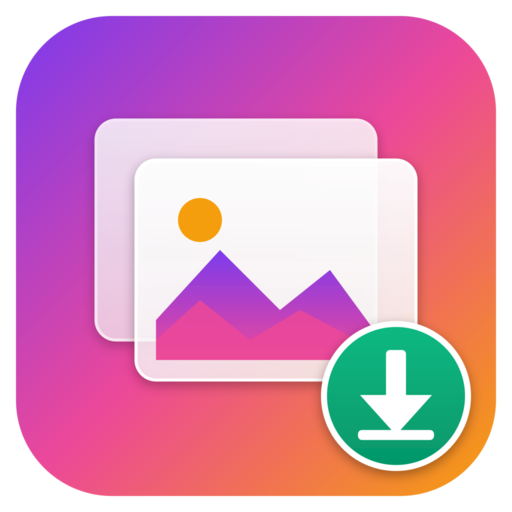

<p align="center">
  
</p>

<h1 align="center">Gallery-DL Studio</h1>

<p align="center">
  <strong>Красивое десктопное приложение для gallery-dl</strong><br>
  Скачивайте изображения и медиа с 180+ сайтов через удобный графический интерфейс
</p>

<p align="center">
  
  
  
  
  
</p>

---

## 📖 Описание

**Gallery-DL Studio** — это кроссплатформенное десктопное приложение с графическим интерфейсом для [gallery-dl](https://github.com/mikf/gallery-dl), мощного инструмента командной строки для скачивания изображений и медиаконтента с более чем 180 веб-сайтов.

Приложение превращает работу с gallery-dl в удобный и визуально приятный процесс:

- 📥 **Очередь загрузок** — добавляйте URL, управляйте приоритетами, ставьте на паузу и возобновляйте
- 🔍 **Предпросмотр контента** — просматривайте, что будет скачано, до начала загрузки
- 📊 **Полная история загрузок** — с поиском, фильтрами и статистикой
- ⚙️ **Визуальный редактор конфигурации** — настраивайте gallery-dl для каждого сайта отдельно
- 🎨 **Тёмная и светлая темы** — с плавными переходами и настраиваемым оформлением

---

## 📸 Скриншоты

> 🚧 *Скриншоты будут добавлены в ближайшее время*

<!--


-->

---

## ✨ Возможности

### 📥 Очередь загрузок
- Добавление URL из буфера обмена или вручную
- Управление приоритетами загрузок (перемещение вверх/вниз)
- Пауза, возобновление и отмена отдельных загрузок
- Пакетные операции — старт/стоп/очистка всей очереди
- Прогресс-бар в реальном времени для каждой загрузки

### 🔍 Предпросмотр
- Сканирование URL перед загрузкой
- Визуальный просмотр содержимого (миниатюры, метаданные)
- Выборочная загрузка — скачивайте только нужные файлы

### 📊 История
- Полный журнал всех загрузок
- Поиск и фильтрация по сайту, дате, статусу
- Статистика загрузок
- Быстрый доступ к скачанным файлам

### ⚙️ Конфигурация
- Визуальный редактор `gallery-dl.conf`
- Настройки для каждого сайта (экстрактора) отдельно
- Управление шаблонами именования файлов
- Настройка выходных директорий

### 🔐 Аутентификация
- Управление учётными данными для различных сайтов
- Поддержка cookie-файлов
- Безопасное хранение паролей

### 📁 Управление файлами
- Настраиваемые директории для скачанных файлов
- Гибкие шаблоны именования файлов
- Автоматическая организация по сайтам и альбомам

### 🎨 Темы и оформление
- Тёмная и светлая темы
- Плавные анимации и переходы (Framer Motion)
- Адаптивный интерфейс

### 🌐 Поддержка 180+ сайтов
Поддерживаются все экстракторы gallery-dl, включая: Pixiv, DeviantArt, ArtStation, Twitter/X, Reddit, Instagram, Tumblr, Imgur, Danbooru и [многие другие](https://github.com/mikf/gallery-dl/blob/master/docs/supportedsites.md).

---

## 🛠 Технологический стек

| Технология | Версия | Назначение |
|---|---|---|
| [Electron](https://www.electronjs.org/) | 32 | Кроссплатформенный десктопный фреймворк |
| [React](https://react.dev/) | 18 | Библиотека UI-компонентов |
| [TypeScript](https://www.typescriptlang.org/) | 5.5 | Типизированный JavaScript |
| [Vite](https://vitejs.dev/) | 5 | Сборщик и dev-сервер |
| [Zustand](https://zustand-demo.pmnd.rs/) | 4.5 | Управление состоянием |
| [better-sqlite3](https://github.com/WiseLibs/better-sqlite3) | 11 | Локальная БД для истории загрузок |
| [Framer Motion](https://www.framer.com/motion/) | 11 | Анимации и переходы |
| [Lucide React](https://lucide.dev/) | — | Библиотека иконок |
| [React Router](https://reactrouter.com/) | 6 | Маршрутизация страниц |
| [date-fns](https://date-fns.org/) | 3 | Работа с датами |

---

## 📦 Установка

### Требования

- **Node.js** 18+ ([скачать](https://nodejs.org/))
- **npm** или **yarn**
- **Python** 3.8+ ([скачать](https://www.python.org/))
- **gallery-dl** — установите через pip:
  ```bash
  pip install gallery-dl
  ```

### Сборка из исходников

```bash
# Клонирование репозитория
git clone https://github.com/your-username/gallery-dl-studio.git
cd gallery-dl-studio

# Установка зависимостей
npm install

# Запуск в режиме разработки
npm run dev

# Сборка продакшен-версии
npm run build
```

Собранные установщики будут находиться в директории `release/`.

### Готовые сборки

| Платформа | Формат |
|---|---|
| 🐧 Linux | AppImage, .deb |
| 🪟 Windows | NSIS-установщик |
| 🍎 macOS | .dmg |

---

## 📁 Структура проекта

```
gallery-dl-studio/
├── src/
│   ├── main/                        # Electron main process
│   │   ├── index.ts                 # Точка входа главного процесса
│   │   ├── ipc/
│   │   │   └── index.ts             # IPC-обработчики (связь main ↔ renderer)
│   │   └── services/
│   │       ├── config.ts            # Сервис конфигурации gallery-dl
│   │       ├── gallery-dl.ts        # Взаимодействие с gallery-dl CLI
│   │       ├── history.ts           # Сервис истории загрузок (SQLite)
│   │       └── queue.ts             # Сервис очереди загрузок
│   │
│   ├── preload/                     # Electron preload scripts
│   │
│   ├── renderer/                    # React frontend (renderer process)
│   │   ├── App.tsx                  # Корневой компонент приложения
│   │   ├── main.tsx                 # Точка входа React
│   │   ├── router.tsx               # Конфигурация маршрутов
│   │   ├── components/
│   │   │   ├── common/              # Переиспользуемые UI-компоненты
│   │   │   │   ├── Badge.tsx        #   Бейджи и метки
│   │   │   │   ├── Button.tsx       #   Кнопки
│   │   │   │   ├── Input.tsx        #   Текстовые поля
│   │   │   │   ├── Modal.tsx        #   Модальные окна
│   │   │   │   ├── ProgressBar.tsx  #   Прогресс-бары
│   │   │   │   ├── Select.tsx       #   Выпадающие списки
│   │   │   │   └── Tooltip.tsx      #   Всплывающие подсказки
│   │   │   ├── download/            # Компоненты загрузок
│   │   │   │   ├── DownloadItem.tsx #   Элемент очереди загрузки
│   │   │   │   ├── QueueControls.tsx#   Управление очередью
│   │   │   │   └── UrlInput.tsx     #   Поле ввода URL
│   │   │   └── layout/              # Компоненты макета
│   │   │       ├── Header.tsx       #   Шапка приложения
│   │   │       ├── Layout.tsx       #   Основной макет
│   │   │       └── Sidebar.tsx      #   Боковая навигация
│   │   ├── hooks/                   # Пользовательские React-хуки
│   │   ├── pages/                   # Страницы приложения
│   │   │   ├── Downloads.tsx        #   📥 Очередь загрузок
│   │   │   ├── Preview.tsx          #   🔍 Предпросмотр
│   │   │   ├── History.tsx          #   📊 История
│   │   │   ├── Config.tsx           #   ⚙️ Конфигурация gallery-dl
│   │   │   └── Settings.tsx         #   🛠 Настройки приложения
│   │   ├── stores/                  # Zustand-хранилища
│   │   │   ├── configStore.ts       #   Состояние конфигурации
│   │   │   ├── downloadStore.ts     #   Состояние загрузок
│   │   │   ├── historyStore.ts      #   Состояние истории
│   │   │   └── themeStore.ts        #   Состояние темы
│   │   ├── styles/                  # Глобальные стили
│   │   │   ├── globals.css          #   Общие стили
│   │   │   ├── themes.css           #   Определения тем
│   │   │   └── variables.css        #   CSS-переменные
│   │   └── types/                   # TypeScript-типы для renderer
│   │
│   └── shared/
│       └── types.ts                 # Общие типы (main + renderer)
│
├── resources/
│   └── icon.png                     # Иконка приложения
├── electron-builder.yml             # Конфигурация сборки Electron
├── index.html                       # HTML-шаблон
├── package.json                     # Зависимости и скрипты
├── tsconfig.json                    # Конфигурация TypeScript
├── tsconfig.node.json               # Конфигурация TS для Node
└── vite.config.ts                   # Конфигурация Vite
```

---

## 🚀 Использование

### 1. Загрузки (Downloads)

Основная страница приложения для скачивания контента:

1. Вставьте URL в поле ввода (или нажмите кнопку вставки из буфера)
2. Нажмите **Добавить** — загрузка добавится в очередь
3. Используйте кнопки управления для каждой загрузки:
   - ▶️ Старт / ⏸ Пауза
   - ⬆️ Повысить / ⬇️ Понизить приоритет
   - ❌ Отменить
4. Панель управления очередью позволяет запустить или остановить все загрузки разом

### 2. Предпросмотр (Preview)

Просмотр содержимого перед скачиванием:

1. Вставьте URL в поле ввода
2. Нажмите **Сканировать** — приложение загрузит метаданные
3. Просмотрите список файлов, которые будут скачаны
4. Выберите нужные элементы и нажмите **Скачать выбранное**

### 3. История (History)

Журнал всех загрузок:

1. Просматривайте полный список скачанных файлов
2. Используйте поиск для нахождения конкретных загрузок
3. Фильтруйте по сайту, статусу или дате
4. Нажмите на элемент, чтобы открыть файл или директорию

### 4. Конфигурация (Config)

Визуальный редактор настроек gallery-dl:

1. Выберите сайт (экстрактор) из списка
2. Настройте параметры: директорию, шаблон имени файла, фильтры
3. Изменения автоматически сохраняются в `gallery-dl.conf`

### 5. Настройки (Settings)

Настройки самого приложения:

1. **Путь к gallery-dl** — укажите путь к исполняемому файлу
2. **Тема** — переключение между тёмной и светлой темами
3. **Директория загрузок** — папка по умолчанию для скачанных файлов
4. **Параллельные загрузки** — количество одновременных загрузок

---

## 👨‍💻 Разработка

### Команды

```bash
# Запуск в режиме разработки с hot reload
npm run dev

# Предпросмотр сборки
npm run preview

# Сборка продакшен-версии + установщик
npm run build
```

### Режим разработки

При запуске `npm run dev` используется Vite с плагинами для Electron:

- **Hot Module Replacement (HMR)** — мгновенное обновление React-компонентов без перезагрузки
- **Автоматический перезапуск** main-процесса при изменении файлов в `src/main/`
- Preload-скрипты пересобираются автоматически

### Архитектура

Приложение следует стандартной архитектуре Electron с разделением на процессы:

```
┌──────────────────────────────────────────────┐
│                Main Process                  │
│  ┌──────────┐  ┌──────────┐  ┌─────────────┐ │
│  │ Services │  │   IPC    │  │  gallery-dl │ │
│  │ (SQLite, │◄─┤ Handlers ├──┤  (spawn)    │ │
│  │  Config) │  └────┬─────┘  └─────────────┘ │
│  └──────────┘       │                        │
└─────────────────────┼────────────────────────┘
                      │ IPC (contextBridge)
┌─────────────────────┼─────────────────────────┐
│              Renderer Process                 │
│  ┌─────────┐  ┌─────┴──────┐  ┌─────────────┐ │
│  │  Pages  │◄─┤   Stores   │  │  Components │ │
│  │         │  │  (Zustand) │  │             │ │
│  └─────────┘  └────────────┘  └─────────────┘ │
└───────────────────────────────────────────────┘
```

- **Main Process** — управляет окном, запускает gallery-dl, работает с БД и конфигурацией
- **Renderer Process** — React-приложение с UI, хранилищами состояния и маршрутизацией
- **Preload** — безопасный мост между main и renderer через `contextBridge`
- **Shared** — общие TypeScript-типы

---

## 📄 Лицензия

Этот проект распространяется под лицензией [MIT](LICENSE).

---

<p align="center">
  Сделано с ❤️ для сообщества gallery-dl
</p>
